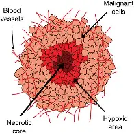

```
eval: whether to evaluate a code chunk.
```

```{r echo=FALSE, include=FALSE}
knitr::opts_chunk$set(warning = FALSE, message = FALSE)
library(knitr)
library(kableExtra)
library(dplyr)
library(formatters)
library(plotly)
library(pharmaverseadam)
library(DT)
```
<!-- ctrl+shift+c -->

# M1234 Analysis

## Information
**Study**: Avelu  
**Indication**: Advanced solid  
**Study start date**: 08^th^ Nov 2024  
**Cutoff date**: 02^nd^ Sep 2025~DSUR~  
~~AE special interest~~

## *Image Loading*

<div style= "text-align: center;">
----This is the image----
{width=50% height=50% }

```{r echo=FALSE, fig.cap= "Fig Image"}

```
## Inline coding
```{r echo=FALSE}
ae_info <- adae %>% count(AETERM) %>%
  arrange(n) %>% slice(0:5)
```
Adverse events <u>`r ae_info$AETERM`

## Dataset {.tabset}
### interactive
To learn more extensions
[Click here 😊](https://rstudio.github.io/DT/extensions.html)
```{r echo=FALSE}
datatable(data.frame(adsl))
```
### static
```{r echo=FALSE}
kable(head(adsl))
```
## Plots
```{r echo=FALSE,warning=FALSE, message=FALSE}
adlb <- ex_adlb %>% filter(PARAMCD == "ALT")  # Filter all data for ALT parameter
plot_ly(data = adlb, x = ~ADY, y = ~AVAL, color = ~USUBJID, type = "scatter", mode = "lines") %>%
        add_lines() %>%
        layout(
          title = "Lab Plot",  # Title of the plot
          xaxis = list(title = "Time since treatment"),  # X-axis label
          yaxis = list(title = "ALT"),  # Y-axis label
          height = 300, width = 800  # Dimensions of the plot
        )
```
## loops {.tabset}
```{r, echo=FALSE, results='asis'}
for (subejct in adsl$USUBJID[1:5]){
   cat('\n')
   cat("### ", subject, "\n")
   ae_info = adae %>% filter(USUBJID==subject)
   cat("#### Adverse events: ", ae_info$AETERM, "\n")
   cat('\n')
}
```
